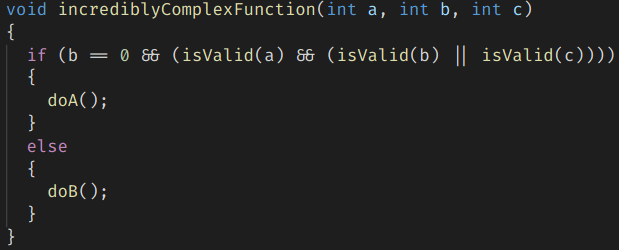

## About this Visual Studio Code extension

This extension is for people that want a more "in the face" approach on highlighting content between symbols. \
Symbols can be custom defined, the extension is not limited to only brackets. Sadly the extension name cannot be changed retroactively. \
It provides a very configurable CSS style markup for the whole text between opening and closing symbols or only the symbols themselves. \
There are preset options for all kinds of brackets.

## Features

Finds the corresponding symbol for the currently selected configured symbol and adds decorations to the text inbetween or only to the symbols themselves. 

**Decoration examples:**

- **user defined opening and closing symbols**


- **multi symbol matching**


- **multi cursor support**


- **highlight only the enclosing symbols**


- **change the font size of the highlighted text**



- **change the color of highlighted text**


- **bold text with increased letter spacing**


- **red border around text**


- **underlined text**


- **changed background color**


- **blurred out text**


- **... Lots of additional possibilities. Just configure it the way you like it.**

**Hotkey actions:**

- Jump to/out of highlighted opening and closing symbols  
- Select the text between highlighted symbols  


## Extension Settings

This extension contributes the following settings:

* `BracketHighlighter.enableExtension`: enables the extension when set.
* `BracketHighlighter.maxLineSearchCount`: The maximum amount of lines to search for a matching symbol. If nothing is found by this number, nothing will be highlighted.
* `BracketHighlighter.highlightScopeFromText`: Allows highlighting when clicking inside of a scope. It will search for the scope of all enabled symbols.
* `BracketHighlighter.allowedLanguageIds`: IDs which this extension will work on. Leaving this blank will enable it globally. Identifiers have to be separated by a comma. E.g. c,cpp,java
* `BracketHighlighter.reverseSearchEnabled`: Enables searching from closing symbols.
* `BracketHighlighter.useParentheses`: enables highlighting between parentheses '()'.
* `BracketHighlighter.useBraces`: enables highlighting between braces '{}'.
* `BracketHighlighter.useBrackets`: enables highlighting between brackets '[]'.
* `BracketHighlighter.useAngularBrackets`: enables highlighting between angular brackets '<>'.
* `BracketHighlighter.fontWeight`: CSS-style setting specifying the weight of the font. E.g. 'bold'
* `BracketHighlighter.fontStyle`: CSS-style setting specifying the style of the font. E.g. 'oblique'
* `BracketHighlighter.letterSpacing`: CSS-style setting specifying the space between letters. E.g. '1px'
* `BracketHighlighter.outline`: CSS-style setting specifying the outline of the text. E.g. '2px dashed blue'
* `BracketHighlighter.border`: CSS-style setting specifying the border around the text. E.g. '4px dotted blue'
* `BracketHighlighter.backgroundColor`: CSS-style setting specifying the color in the background of the text. E.g. 'coral'
* `BracketHighlighter.textDecoration`: CSS-style setting specifying additional decorations around the text. E.g. 'underline' 
* `BracketHighlighter.activeInDebugMode`: Enables the extension when debugging. 
* `BracketHighlighter.blurOutOfScopeText`: Enables a blur effect on non-highlighted text. (Opacity depends on blurOpacity value)
* `BracketHighlighter.blurOpacity`: Sets the opacity of the blurred out text. E.g. 0.5
* `BracketHighlighter.customSymbols`: User defined symbols which have to have a defined "open" and "close" value. Open and close values must not be the same. Symbols don't have to be unique, however the first entry in this list will always have priority.
E.g.
```
"BracketHighlighter.customSymbols": [
    {
        "open": "do",
        "close": "end"
    },
    {
        "open": "/*",
        "close": "*/"
    }
]
```
* `BracketHighlighter.timeOutValue`: Sets a value in milliseconds how often highlighting can be triggered. A higher value will increase performance when writing, however highlighting may be delayed in some cases. Setting this to 0 will make the extension behave as it did before this option existed.
* `BracketHighlighter.ignoreContent`: Ignores content in the scope and instead only highlights the enclosing symbols.
* `BracketHighlighter.textColor`: Sets the color of the highlighted text.
* `BracketHighlighter.fontSizeMultiplicator`: Scales the font size of the highlighted text as a multiplicator of the configured font size of the editor. E.g. '1.25'.

## Hotkeys provided by extension

This extension provides several hotkeys to work with highlighted symbols.

* `BracketHighlighter.toggleExtensionStatus`: Enables/Disables the extension. (Default hotkey: Ctrl + Alt + L)
* `BracketHighlighter.jumpOutOfClosingSymbol`: Jumps to the outside of the closing symbol. (Default hotkey: Ctrl + Alt + DownArrow)
* `BracketHighlighter.jumpOutOfOpeningSymbol`: Jumps to the outside of the opening symbol. (Default hotkey: Ctrl + Alt + UpArrow)
* `BracketHighlighter.jumpToClosingSymbol`: Jumps to the inside of the closing symbol. (Default hotkey: Ctrl + Alt + RightArrow)
* `BracketHighlighter.jumpToOpeningSymbol`: Jumps to the inside of the opening symbol. (Default hotkey: Ctrl + Alt + LeftArrow)
* `BracketHighlighter.selectTextInSymbols`: Selects the whole text between (and not including) the symbols. (Default hotkey: Ctrl + Alt + K)


Refer to https://www.w3schools.com/cssref/ for all CSS options.
Refer to https://code.visualstudio.com/docs/languages/identifiers for available language identifiers.
Refer to https://www.w3schools.com/cssref/css_colors_legal.asp for possible color values.

## Known Issues
High CPU usage can occur. This cannot be avoided, because the extension has to search through the text in a file.
If it gets too bad, try increasing the timeOutValue and/or reduce the maxLineSearchCount.

Multiple ranges to highlight which share the same parent scope don't behave well with the blurring option enabled.
This will likely not be fixed.

## Release Notes
For all notes please refer to the changelog.
Only the latest 3 releases will be shown here.

## [2.2.1]
- Fixed issue where HighlightScopeFromText sometimes wouldn't work correctly

## [2.2.0]
- Added support for highlighting of symbols share the same opening or closing symbols
- Added option to change the font size of highlighted text

## [2.1.0]
- Added experimental support to ignore escaped symbols: To use it, enable the regex mode in the settings. If you find any errors, please open a ticket!
- Fixed uncaught error exceptions

## Planned improvements
- This extension is feature complete. If you think something is missing please refer to the next paragraph.

## Feature requests and bug reports
Please mail them to me at dev@durzn.com or create an open issue at https://github.com/Durzn/BracketHighlighter
Thanks to everyone reporting issues and requesting new features. The extension wouldn't be anywhere near where it currently is without these.

# Special thanks
## Art_of_bini 
for the great extension icon. See more from her on her instagram page https://www.instagram.com/art_of_bini/
## You
for using this extension :)
