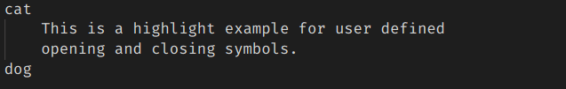
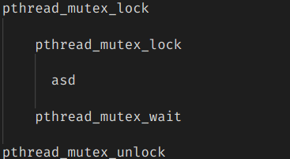
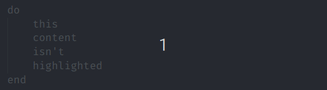
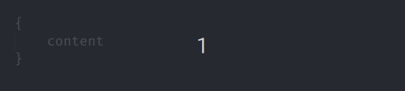
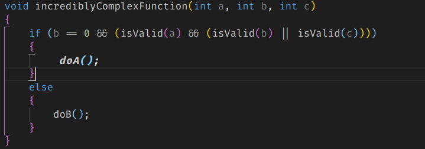
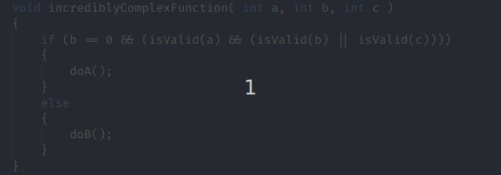
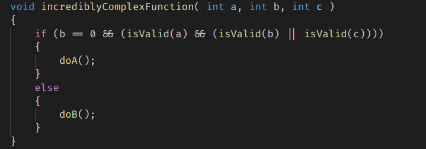
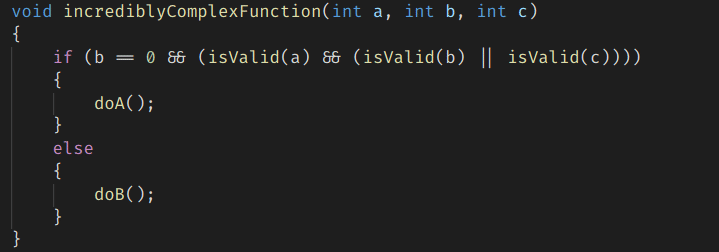
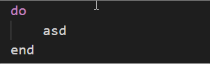
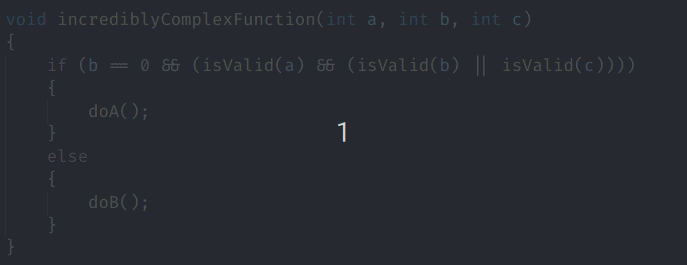

# About this Visual Studio Code extension

This extension is for people that want a more "in the face" approach on highlighting content between symbols. \
Symbols can be custom defined, the extension is not limited to only brackets. Sadly the extension name cannot be changed retroactively. \
It provides a very configurable CSS style markup for the whole text between opening and closing symbols or only the symbols themselves. \
There are preset options for all kinds of brackets.

# Features

- Highlights pairs of symbols that are at the cursor or if the cursor is in the scope of the pair
- Symbols can be configured and support regular expressions
- Multiple cursors support
- Hotkey actions to jump to the highlight pairs
- Hotkey action to select all text between a highlight pair

# Upgrade to version 3.0.0
- Please refer to chapter [custom symbols](#custom-symbols) for information how the new syntax for highlight symbols looks like
- The extension will try to use symbols with the old syntax
- Some settings were removed, which means there are no more symbols available via checkboxes => All symbols must now be configured within custom symbols. You can find a minimal example in the [custom symbols](#custom-symbols) chapter.


**Decoration examples:**

- **user defined opening and closing symbols**



- **multi symbol matching**



- **multi cursor support**


- **highlight only the enclosing symbols**



- **change the color of highlighted text**



- **bold text with increased letter spacing**



- **red border around text**



- **underlined text**


- **changed background color**



- **blurred out text**



- **separate highlighting of symbols and content**




- **... Lots of additional possibilities. Just configure it the way you like it.**

**Hotkey actions:**

- Jump to/out of highlighted opening and closing symbols  
- Select the text between highlighted symbols  



# Extension Settings

This extension contributes the following settings:

* `BracketHighlighter.enableExtension`: enables the extension when set.
* `BracketHighlighter.maxLineSearchCount`: The maximum amount of lines to search for a matching symbol. If nothing is found by this number, nothing will be highlighted.
* `BracketHighlighter.highlightScopeFromText`: Allows highlighting when clicking inside of a scope. It will search for the scope of all enabled symbols.
* `BracketHighlighter.allowedLanguageIds`: IDs which this extension will work on. Leaving this blank will enable it globally. Identifiers have to be separated by a comma. E.g. c,cpp,java
* `BracketHighlighter.fontWeight`: fontWeight in CSS style. E.g. 'bold'. If separate highlighting for symbols and content is used, this parameter is used for the content
* `BracketHighlighter.fontStyle`: fontStyle in CSS style. E.g. 'oblique'. If separate highlighting for symbols and content is used, this parameter is used for the content
* `BracketHighlighter.letterSpacing`: letterSpacing in CSS style. E.g. '1px'. If separate highlighting for symbols and content is used, this parameter is used for the content
* `BracketHighlighter.outline`: outline in CSS style. E.g. '2px dashed blue'. If separate highlighting for symbols and content is used, this parameter is used for the content
* `BracketHighlighter.border`: border in CSS style. E.g. '4px dotted blue'. If separate highlighting for symbols and content is used, this parameter is used for the content
* `BracketHighlighter.backgroundColor`: backgroundColor in CSS style. E.g. 'coral'. If separate highlighting for symbols and content is used, this parameter is used for the content
* `BracketHighlighter.differentSymbolHighlightingUsed`: If enabled, separate text decorations can be used for symbols and content.
* `BracketHighlighter.fontWeightSymbol`: Parameter is used for symbols only if separate highlighting for symbols and content is enabled: fontWeight in CSS style. E.g. 'bold'
* `BracketHighlighter.fontStyleSymbol`: Parameter is used for symbols only if separate highlighting for symbols and content is enabled: fontStyle in CSS style. E.g. 'oblique'
* `BracketHighlighter.letterSpacingSymbol`: Parameter is used for symbols only if separate highlighting for symbols and content is enabled: letterSpacing in CSS style. E.g. '1px'
* `BracketHighlighter.outlineSymbol`: Parameter is used for symbols only if separate highlighting for symbols and content is enabled: outline in CSS style. E.g. '2px dashed blue'
* `BracketHighlighter.borderSymbol`: Parameter is used for symbols only if separate highlighting for symbols and content is enabled: border in CSS style. E.g. '4px dotted blue'
* `BracketHighlighter.backgroundColorSymbol`: Parameter is used for symbols only if separate highlighting for symbols and content is enabled: backgroundColor in CSS style. E.g. 'coral'
* `BracketHighlighter.textDecorationSymbol`: Parameter is used for symbols only if separate highlighting for symbols and content is enabled: textDecoration in CSS style. E.g. 'underline'
* `BracketHighlighter.activeInDebugMode`: Enables the extension when debugging. 
* `BracketHighlighter.blurOutOfScopeText`: Enables a blur effect on non-highlighted text. (Opacity depends on blurOpacity value)
* `BracketHighlighter.blurOpacity`: Sets the opacity of the blurred out text. E.g. 0.5
* `BracketHighlighter.timeOutValue`: Sets a value in milliseconds how often highlighting can be triggered. A higher value will increase performance when writing, however highlighting may be delayed in some cases. Setting this to 0 will make the extension behave as it did before this option existed.
* `BracketHighlighter.ignoreContent`: Ignores content in the scope and instead only highlights the enclosing symbols.
* `BracketHighlighter.textColor`: Sets the color of the highlighted text.
* `BracketHighlighter.customSymbols`: User defined symbols which have to have a defined "open" and "close" value. Open and close values must not be the same. Symbols don't have to be unique, however the first entry in this list will always have priority.

# Custom symbols
A minimal example for custom symbols - if you don't want to get into the details - looks like the following:

```json
    "BracketHighlighter.customSymbols": [
        {
            "highlightPair": [
                {
                    "symbol": "/*",
                },
                {
                    "symbol": "*/",
                }
            ]
        }
    ]
```
Note that the order of the highlight pair actually matters. The first entry of the highlight pair will be the opening symbol, the second one the closing symbol.

This configuration can be extended to the following for a more fine-grained control:
```json
    "BracketHighlighter.customSymbols": [
        {
            "highlightPair": [
                {
                    "symbol": "/*",
                    "isRegex": false,
                    "canBeSubstring": true
                },
                {
                    "symbol": "*/",
                    "isRegex": false,
                    "canBeSubstring": true
                }
            ],
            "jumpBetweenStrategy": "toSymbolOppositeSide"
        }
    ]
```

# Hotkeys provided by extension

This extension provides several hotkeys to work with highlighted symbols.

* `BracketHighlighter.toggleExtensionStatus`: Enables/Disables the extension. (Default hotkey: Ctrl + Alt + L)
* `BracketHighlighter.jumpOutOfClosingSymbol`: Jumps to the outside of the closing symbol. (Default hotkey: Ctrl + Alt + DownArrow)
* `BracketHighlighter.jumpOutOfOpeningSymbol`: Jumps to the outside of the opening symbol. (Default hotkey: Ctrl + Alt + UpArrow)
* `BracketHighlighter.jumpToClosingSymbol`: Jumps to the inside of the closing symbol. (Default hotkey: Ctrl + Alt + RightArrow)
* `BracketHighlighter.jumpToOpeningSymbol`: Jumps to the inside of the opening symbol. (Default hotkey: Ctrl + Alt + LeftArrow)
* `BracketHighlighter.selectTextInSymbols`: Selects the whole text between (and not including) the symbols. (Default hotkey: Ctrl + Alt + K)
* `BracketHighlighter.jumpBetweenOpeningAndClosingSymbols`: Jumps between the opening and closing symbols. (Default hotkey: Ctrl + Alt + \\)


Refer to https://www.w3schools.com/cssref/ for all CSS options.
Refer to https://code.visualstudio.com/docs/languages/identifiers for available language identifiers.
Refer to https://www.w3schools.com/cssref/css_colors_legal.asp for possible color values.

# Known Issues
High CPU usage can occur. This cannot be avoided, because the extension has to search through the text in a file.
If it gets too bad, try increasing the timeOutValue and/or reduce the maxLineSearchCount.

Multiple ranges to highlight which share the same parent scope don't behave well with the blurring option enabled.
This will likely not be fixed.

# Release Notes
For all notes please refer to the changelog.

# Planned improvements
- This extension is feature complete. If you think something is missing please refer to the next paragraph.

# Feature requests and bug reports
Please mail them to me at dev@durzn.com or create an open issue at https://github.com/Durzn/BracketHighlighter
Thanks to everyone reporting issues and requesting new features. The extension wouldn't be anywhere near where it currently is without these.

# Special thanks
## Art_of_bini 
for the great extension icon. See more from her on her instagram page https://www.instagram.com/art_of_bini/
## You
for using this extension :)

# Support
I'm working on projects like this extension in my free time. 
If you want to buy me a coffee to keep me awake for more work on my projects, I'd greatly appreciate it.

<a href='https://ko-fi.com/H2H4Q3C6N' target='_blank'></a>

I also gladly accept ``Ada`` over this address: ``addr1qyz4hp9a5m844c5dn7nz56vget0lcx2lxg9eg02x9nyg82m7306tyvjqygl08grv79tm2jw0sh9lg8nr5u0g0qvf2nlsw376z4``