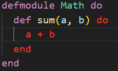

# About this Visual Studio Code extension

This extension is for people that want a more "in the face" approach on highlighting content between symbols. \
Symbols can be custom defined, the extension is not limited to only brackets. Sadly the extension name cannot be changed retroactively. \
It provides a very configurable CSS style markup for the whole text between opening and closing symbols or only the symbols themselves. \
There are preset options for all kinds of brackets.

# Features

- Highlights pairs of symbols that are at the cursor or if the cursor is in the scope of the pair
- Symbols can be configured and support regular expressions
- Multiple cursors support
- Hotkey actions to jump to the highlight pairs
- Hotkey action to select all text between a highlight pair

# Support
If you find this extension helpful, please consider supporting its development with a donation.  
Your contributions help me maintain and improve the extension over time. Every bit is appreciated and keeps this project going.

<a href='https://ko-fi.com/H2H4Q3C6N' target='_blank'></a>

# Upgrade to version 3.0.0
- Please refer to the chapter [quick setup](#quick-setup-of-old-parameters) if you want to quickly get started with basic symbol support
- Please refer to the chapter [custom symbols](#custom-symbols) for more information how the new syntax for highlight symbols looks like
- The extension will try to use symbols with the old syntax, but be aware that it is deprecated and might not work as you expect it to
- Some settings were removed, which means there are no more symbols available via checkboxes => All symbols must now be configured within custom symbols. You can find a minimal example in the [minimal example](#minimal-custom-symbol-example) chapter.


# Decoration examples

| Example                            | Description                               |
| ---------------------------------- | ----------------------------------------- |
|     | Change background color                   |
|                | Blur everything not in scope              |
|   | Highlight symbols and content differently |
| | Highlight symbols and content the same    |
|      | Highlight only the symbols                |
|         | Multiple cursor support                   |
|      | Change the way the text looks             |

- **... Lots of additional possibilities. Just configure it the way you like it.**

**Hotkey actions:**

- Jump to/out of highlighted opening and closing symbols  
- Jump to the corresponding symbol pair
- Select the text between highlighted symbols


# Extension Settings

This extension contributes the following settings:

| Setting                                               | Description                                                                                                                                       |
| ----------------------------------------------------- | ------------------------------------------------------------------------------------------------------------------------------------------------- |
| `BracketHighlighter.enableExtension`                  | Enables the extension when set.                                                                                                                   |
| `BracketHighlighter.maxLineSearchCount`               | The maximum amount of lines to search for a matching symbol. If nothing is found by this number, nothing will be highlighted.                     |
| `BracketHighlighter.highlightScopeFromText`           | Allows highlighting when clicking inside of a scope. It will search for the scope of all enabled symbols.                                         |
| `BracketHighlighter.allowedLanguageIds`               | IDs which this extension will work on. Leaving this blank will enable it globally. Identifiers have to be separated by a comma. E.g. c,cpp,java.  |
| `BracketHighlighter.fontWeight`                       | FontWeight in CSS style. E.g. 'bold'. If separate highlighting for symbols and content is used, this parameter is used for the content.           |
| `BracketHighlighter.fontStyle`                        | FontStyle in CSS style. E.g. 'oblique'. If separate highlighting for symbols and content is used, this parameter is used for the content.         |
| `BracketHighlighter.letterSpacing`                    | LetterSpacing in CSS style. E.g. '1px'. If separate highlighting for symbols and content is used, this parameter is used for the content.         |
| `BracketHighlighter.outline`                          | Outline in CSS style. E.g. '2px dashed blue'. If separate highlighting for symbols and content is used, this parameter is used for the content.   |
| `BracketHighlighter.border`                           | Border in CSS style. E.g. '4px dotted blue'. If separate highlighting for symbols and content is used, this parameter is used for the content.    |
| `BracketHighlighter.backgroundColor`                  | BackgroundColor in CSS style. E.g. 'coral'. If separate highlighting for symbols and content is used, this parameter is used for the content.     |
| `BracketHighlighter.textColor`                        | Sets the color of the highlighted text.                                                                                                           |
| `BracketHighlighter.differentSymbolHighlightingUsed`  | If enabled, separate text decorations can be used for symbols and content.                                                                        |
| `BracketHighlighter.fontWeightSymbol`                 | Parameter is used for symbols only if separate highlighting for symbols and content is enabled: fontWeight in CSS style. E.g. 'bold'.             |
| `BracketHighlighter.fontStyleSymbol`                  | Parameter is used for symbols only if separate highlighting for symbols and content is enabled: fontStyle in CSS style. E.g. 'oblique'.           |
| `BracketHighlighter.letterSpacingSymbol`              | Parameter is used for symbols only if separate highlighting for symbols and content is enabled: letterSpacing in CSS style. E.g. '1px'.           |
| `BracketHighlighter.outlineSymbol`                    | Parameter is used for symbols only if separate highlighting for symbols and content is enabled: outline in CSS style. E.g. '2px dashed blue'.     |
| `BracketHighlighter.borderSymbol`                     | Parameter is used for symbols only if separate highlighting for symbols and content is enabled: border in CSS style. E.g. '4px dotted blue'.      |
| `BracketHighlighter.backgroundColorSymbol`            | Parameter is used for symbols only if separate highlighting for symbols and content is enabled: backgroundColor in CSS style. E.g. 'coral'.       |
| `BracketHighlighter.textDecorationSymbol`             | Parameter is used for symbols only if separate highlighting for symbols and content is enabled: textDecoration in CSS style. E.g. 'underline'.    |
| `BracketHighlighter.textColorSymbol`                  | Parameter is used for symbols only if separate highlighting for symbols and content is enabled: Sets the color of the highlighted text.           |
| `BracketHighlighter.activeInDebugMode`                | Enables the extension when debugging.                                                                                                             |
| `BracketHighlighter.blurOutOfScopeText`               | Enables a blur effect on non-highlighted text. Opacity depends on blurOpacity value.                                                              |
| `BracketHighlighter.blurOpacity`                      | Sets the opacity of the blurred out text. E.g. 0.5 for 50% visibility.                                                                            |
| `BracketHighlighter.ignoreContent`                    | Ignores content in the scope and instead only highlights the enclosing symbols.                                                                   |
| `BracketHighlighter.timeOutValue`                     | Sets a value in milliseconds how often highlighting can be triggered. A higher value will increase performance when writing, however highlighting may be delayed in some cases. Setting this to 0 will make the extension behave as it did before this option existed.                                                                                                       |
| `BracketHighlighter.customSymbols`                    | User defined symbols, which are explained in more detail in the extension description.                                                            |

Refer to https://www.w3schools.com/cssref/ for all CSS options. \
Refer to https://code.visualstudio.com/docs/languages/identifiers for available language identifiers. \
Refer to https://www.w3schools.com/cssref/css_colors_legal.asp for possible color values. \


# Hotkeys provided by extension

This extension provides several hotkeys to work with highlighted symbols and ranges.

| Hotkey setting                                            | Description                                                                                        |
| --------------------------------------------------------- | -------------------------------------------------------------------------------------------------- |
| `BracketHighlighter.toggleExtensionStatus`                | Enables/Disables the extension. (Default hotkey: Ctrl + Alt + L)                                   |
| `BracketHighlighter.jumpOutOfClosingSymbol`               | Jumps to the outside of the closing symbol. (Default hotkey: Ctrl + Alt + DownArrow)               |
| `BracketHighlighter.jumpOutOfOpeningSymbol`               | Jumps to the outside of the opening symbol. (Default hotkey: Ctrl + Alt + UpArrow)                 |
| `BracketHighlighter.jumpToClosingSymbol`                  | Jumps to the inside of the closing symbol. (Default hotkey: Ctrl + Alt + RightArrow)               |
| `BracketHighlighter.jumpToOpeningSymbol`                  | Jumps to the inside of the opening symbol. (Default hotkey: Ctrl + Alt + LeftArrow)                |
| `BracketHighlighter.selectTextInSymbols`                  | Selects the whole text between (and not including) the symbols. (Default hotkey: Ctrl + Alt + K)   |
| `BracketHighlighter.jumpBetweenOpeningAndClosingSymbols`  | Jumps between the opening and closing symbols. (Default hotkey: Ctrl + Alt + \\)                   |


# Quick setup of old parameters
If you just quickly want to quickly get a setup for all available types of brackets, simply copy the following into your ```settings.json``` file. \
For more details about the structure refer to the [custom symbols](#custom-symbols) chapter.

```json 
    "BracketHighlighter.customSymbols": [
        {
            "highlightPair": [
                {
                    "symbol": "(",
                    "isRegex": false,
                    "canBeSubstring": true
                },
                {
                    "symbol": ")",
                    "isRegex": false,
                    "canBeSubstring": true
                }
            ]
        },
        {
            "highlightPair": [
                {
                    "symbol": "[",
                    "isRegex": false,
                    "canBeSubstring": true
                },
                {
                    "symbol": "]",
                    "isRegex": false,
                    "canBeSubstring": true
                }
            ]
        },
        {
            "highlightPair": [
                {
                    "symbol": "{",
                    "isRegex": false,
                    "canBeSubstring": true
                },
                {
                    "symbol": "}",
                    "isRegex": false,
                    "canBeSubstring": true
                }
            ]
        },
        {
            "highlightPair": [
                {
                    "symbol": "<",
                    "isRegex": false,
                    "canBeSubstring": true
                },
                {
                    "symbol": ">",
                    "isRegex": false,
                    "canBeSubstring": true
                }
            ]
        }
    ]
```

# Custom symbols

The following example highlights an advanced usage scenario with regular expressions. \
Here you can see the full configuration set. It is not necessary to set everything here, for a minimal example refer to chapter [minimal custom example](#minimal-custom-symbol-example). \
The following parameters can be configured for each highlight pair:
- ```symbol: ``` Symbol to use for the pair
- ```isRegex: ``` Whether the given symbol is a regular expression
- ```canBeSubstring: ``` Whether the given symbol can be part of a substring or not. Not used if ```isRegex: true```.

---
**NOTE**

Please note the following points:
- The order of the highlight pair actually matters. The first entry of the highlight pair will be the opening symbol, the second one the closing symbol.
- Multiple symbols with the same starting or closing symbols can cause weird or unexpected behavior. Consider using a regular expression, which combines the symbols instead.
---


```json
    "BracketHighlighter.customSymbols": [
        {
            "highlightPair": [
              {
                  "symbol": "\\b(do\\b(?!:)|fn\\b)",
                  "isRegex": true,
                  "canBeSubstring": true
              },
              {
                  "symbol": "\\bend\\b",
                  "isRegex": true,
                  "canBeSubstring": true
              },
            ],
            "jumpBetweenStrategy": "toSymbolOppositeSide"
        }
    ]
```

# Minimal custom symbol example

The smalles configuration you can have with the new syntax is the following:

```json
    "BracketHighlighter.customSymbols": [
        {
            "highlightPair": [
              {
                  "symbol": "/*",
              },
              {
                  "symbol": "*/",
              },
            ],
        }
    ]
```

# Planned improvements
- This extension is feature complete. If you think something is missing please refer to the next paragraph.

# Feature requests and bug reports
Please mail them to me at dev@durzn.com or create an open issue at https://github.com/Durzn/BracketHighlighter
Thanks to everyone reporting issues and requesting new features. The extension wouldn't be anywhere near where it currently is without these.

# Special thanks
## Art_of_bini 
for the great extension icon. See more from her on her instagram page https://www.instagram.com/art_of_bini/
## You
for using this extension :)